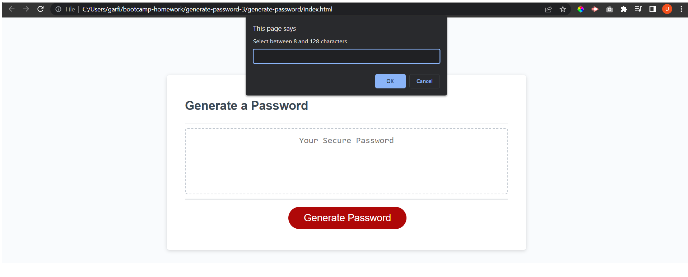
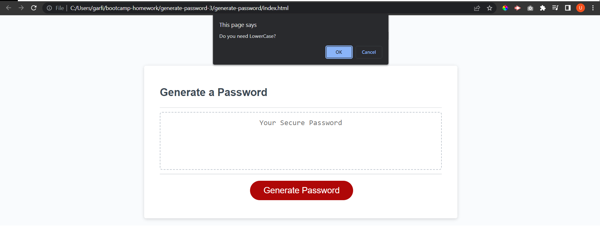
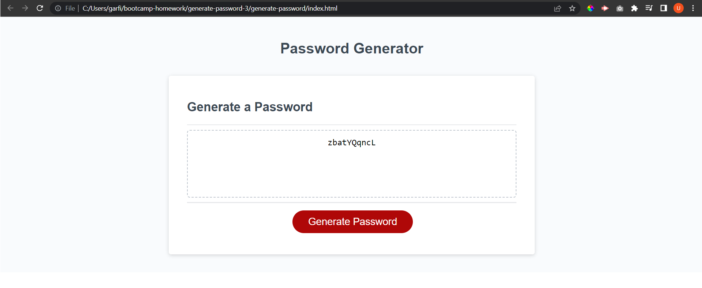

# generate-password

## Description
Given a prebuilt application, a JavaScript file needed a function to randomly create a password for any user who selected a length of characters from 8 to 128, and be displayed on the main page. The main learned lesson from this project is the importance of pseudocoding and how important JavaScript fundamentals are.

## Usage
This web application generates a random password when the user selects from 8 to 128 characters, an advantage of this web application is that the user can choose the type of characters to be randomly display (UpperCase, LowerCase, Numbers, Symbols). Once the "Generate Password" button is clicked a small window is going to be prompted, once the number of characters needed are entered by the user, after selecting the desired characters the password will be displayed.

URL: https://garfias06.github.io/generate-password/

## Credits
Tutor: Jose Lopez.
https://www.w3schools.com/

## License
MIT License

Copyright (c) [2023] [Ulises Garfias]

Permission is hereby granted, free of charge, to any person obtaining a copy
of this software and associated documentation files (the "Software"), to deal
in the Software without restriction, including without limitation the rights
to use, copy, modify, merge, publish, distribute, sublicense, and/or sell
copies of the Software, and to permit persons to whom the Software is
furnished to do so, subject to the following conditions:

The above copyright notice and this permission notice shall be included in all
copies or substantial portions of the Software.

THE SOFTWARE IS PROVIDED "AS IS", WITHOUT WARRANTY OF ANY KIND, EXPRESS OR
IMPLIED, INCLUDING BUT NOT LIMITED TO THE WARRANTIES OF MERCHANTABILITY,
FITNESS FOR A PARTICULAR PURPOSE AND NONINFRINGEMENT. IN NO EVENT SHALL THE
AUTHORS OR COPYRIGHT HOLDERS BE LIABLE FOR ANY CLAIM, DAMAGES OR OTHER
LIABILITY, WHETHER IN AN ACTION OF CONTRACT, TORT OR OTHERWISE, ARISING FROM,
OUT OF OR IN CONNECTION WITH THE SOFTWARE OR THE USE OR OTHER DEALINGS IN THE
SOFTWARE.---

